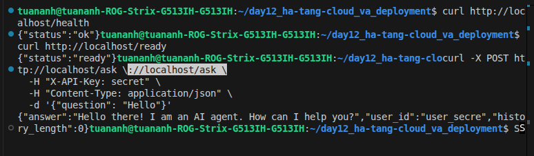
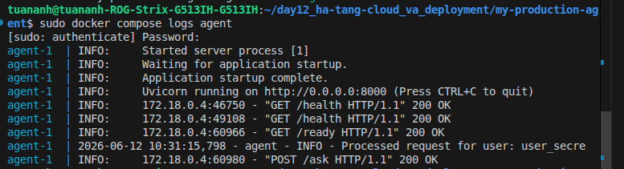
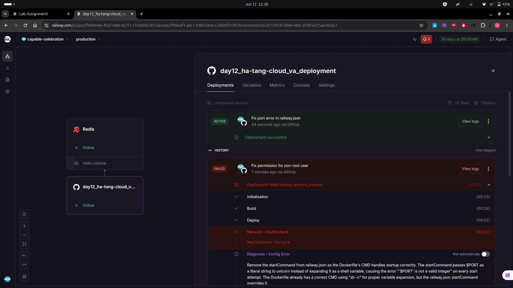

# Deployment Information

## Public URL
https://day12ha-tang-cloudvadeployment-production-2d4f.up.railway.app

## Platform
Railway / Render / Cloud Run

## Test Commands

### Health Check
```bash
curl https://day12ha-tang-cloudvadeployment-production-2d4f.up.railway.app/health
# Expected: {"status": "ok"}
```

### Readiness Check
```bash
curl https://day12ha-tang-cloudvadeployment-production-2d4f.up.railway.app/ready
# Expected: {"status": "ready"}
```

### API Test (with authentication)
```bash
curl -X POST https://day12ha-tang-cloudvadeployment-production-2d4f.up.railway.app/ask \
  -H "X-API-Key: secret" \
  -H "Content-Type: application/json" \
  -d '{"question": "Hello"}'
```

## Environment Variables Set
- PORT
- REDIS_URL
- AGENT_API_KEY
- LOG_LEVEL
- RATE_LIMIT_PER_MINUTE
- MONTHLY_BUDGET_USD

## Screenshots

### 1. Deployment dashboard


### 2. Service running


### 3. Test results

